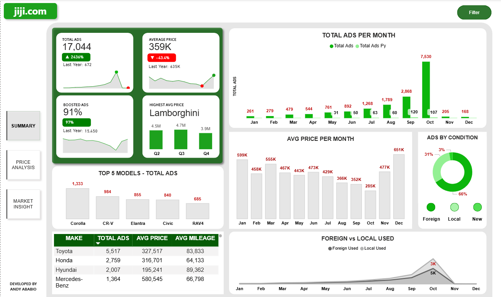
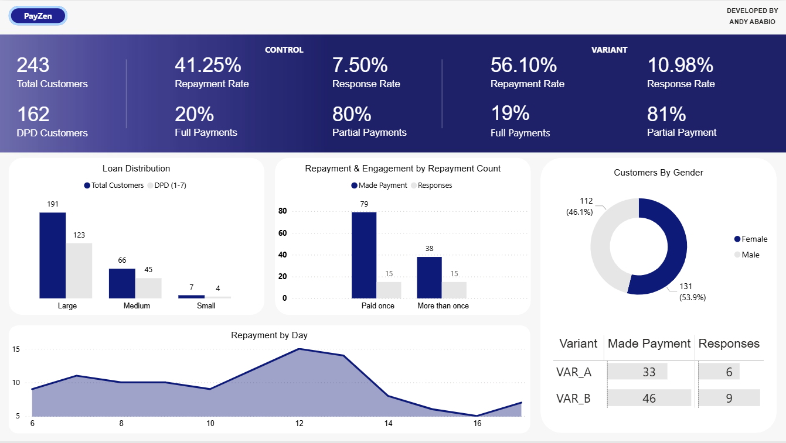
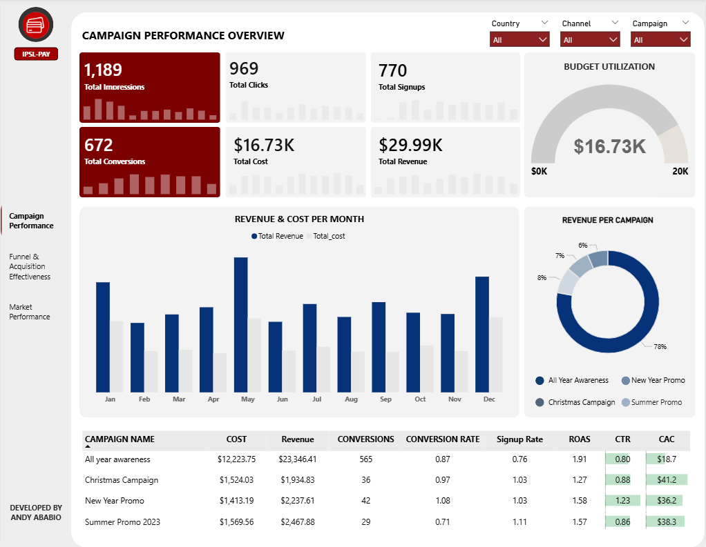
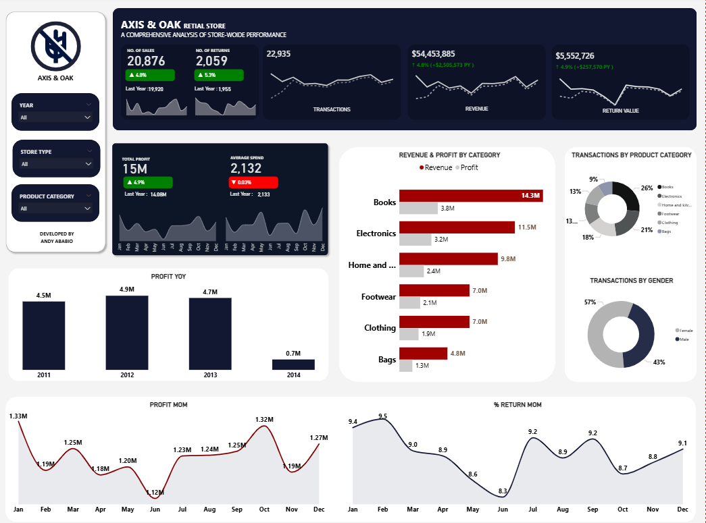

  

<h1 align="center">
  Hi there👋, I'm 
  <a href="https://linkedin.com/in/andy-ababio/" style="color:#3498db;" target="_blank">
    Andy Ababio
  </a>
</h1>

I am **`Certified Data Analyst Professional`** with knowledge in Python, SQL, Power BI, and Data Visualization. My work spans data extraction, modeling, analysis, and visualization: with a focus on effectively communicating to (non)-technical teams helping to understand performance, optimize decisions, and drive measurable outcomes.

#

#### Languages and Tools

 

#### Connect with me

 

#

# Projects

| Project | Tools | Description | Thumbnail |
|--------|-------|-------------|-----------|
| [Marketplace Analysis & Insight - Jiji Cars](https://github.com/andyababio/Jiji-Cars-Analysis) | Python, MySQL, Power BI | End-to-end analysis of car listings on Jiji.com using web scraping, data cleaning, SQL analysis, and interactive Power BI dashboards to generate marketplace insights. |  |
| [A/B Testing Message Framing](https://github.com/andyababio/A-B-Testing-Message-Framing-to-Improve-Loan-Repayments) | Excel, Power BI | This project demonstrates the design and execution of an A/B test to optimize digital loan recovery campaigns. It compares standard reminder messages with empathetic, supportive messaging to identify which approach drives higher repayment rates. |  |
| [Marketing Funnel & ROI Analytics](https://github.com/andyababio/Marketing-Funnel-and-ROI-Analytics) | Excel, Power BI | The analysis tracks multi-channel campaign performance across the full user funnel — from impressions and clicks to sign-ups, purchases, and revenue, while evaluating spend efficiency, ROI, and market-level performance. |  |
| [Sales, Profitability & Customer Insight](https://github.com/andyababio/Sales-Profitabilty-CustomerInsight) | MySQL, Power BI | Operational and retail performance analysis for a U.S.-based multi-category store, uncovering revenue, profitability, and customer behavior insights for decision-makers. |  |
| [Employee Demographics & HR Analytics](https://github.com/andyababio/Employee-Insights-and-Analytics---DISC-CORP) | MySQL, Power BI | Workforce analytics project analyzing employee demographics and trends to support data-driven HR decision-making. |  |

## Internal Tools & Automation
| Project | Tools | Description | Thumbnail |
|--------|-------|-------------|-----------|
| [File Access Portal](https://github.com/andyababio/File_access_portal) | Python (Flask), HTML, CSS | Secure web application allowing users to download personalized documents using name and unique ID verification. |  |

<!--
# TESTING 4
## 🖼️ Dashboard Gallery

| | |
|--|--|
|  |  |
| **Jiji Cars Analysis** [View](link) | **Sales & Profitability** [View](link) |
-->

